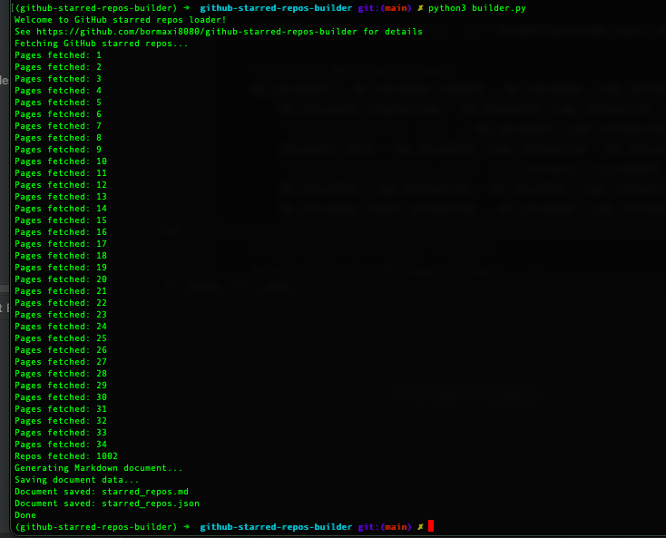
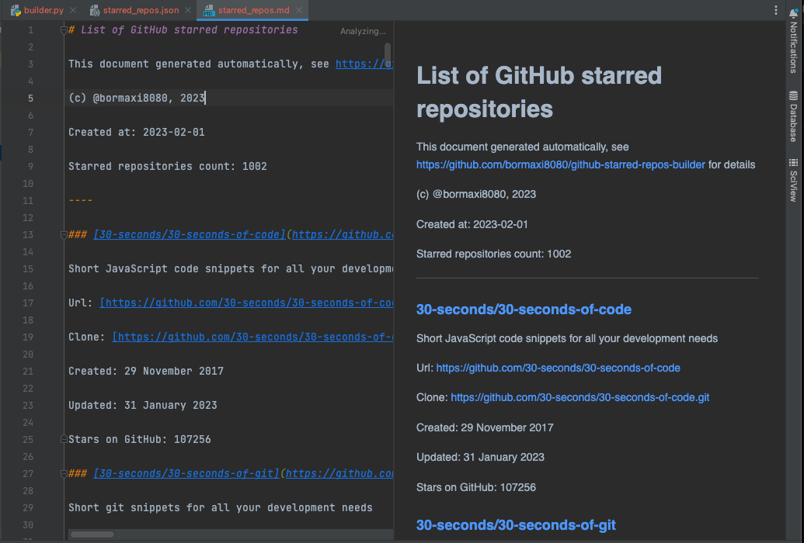

# github-starred-repos-builder

Python script for build all your starred GitHub repositories information in JSON and Markdown documents.

## Purposes:

This Python script helps for generate Markdown description document contains all your GitHub starred repositories.

This is typically needed in a situation when you have many starred repositories to view, such as collection of various utilities.

This script does simple things:

> Gets list of your starred GitHub repositories.
>
> Generate JSON and Markdown documents with your GitHub starred repos statistics

That's all.

*It works on GitHub only! (not in GitLab or BitBucket)

### Important!

If you have a lot of starred GitHub repositories, operations may take a long time to complete.

## Usage:

- Clone this repository
- Run pip3 install -r requirements.txt
- Create environment variable GITHUB_API_TOKEN with your GitHub API token
- Run 'python3 builder.py' and wait

- Bingo!!!

Results:

You can see full results example in [Markdown](./starred_repos.md) and [JSON](./starred_repos.json) documents

## Related projects:

Also I use [github-starred-repos-loader](https://github.com/bormaxi8080/github-starred-repos-loader) and [git-repos-updater](https://github.com/bormaxi8080/git-repos-updater) shell scripts to pull and update my starred GitHub collected repos locally.

## Notes:

### How to get your GitHub personal API access token for API:

[https://docs.github.com/en/authentication/keeping-your-account-and-data-secure/creating-a-personal-access-token](https://docs.github.com/en/authentication/keeping-your-account-and-data-secure/creating-a-personal-access-token)

### More about GitHub stars:

[https://stars.github.com/](https://stars.github.com/)

### More about GitHub API:

[https://docs.github.com/en/rest](https://docs.github.com/en/rest)

### More about GitHub Starred API:

[https://docs.github.com/en/rest/activity/starring](https://docs.github.com/en/rest/activity/starring)

### More About GitHub API Pagination Requests:

[https://docs.github.com/en/rest/guides/traversing-with-pagination](https://docs.github.com/en/rest/guides/traversing-with-pagination)
