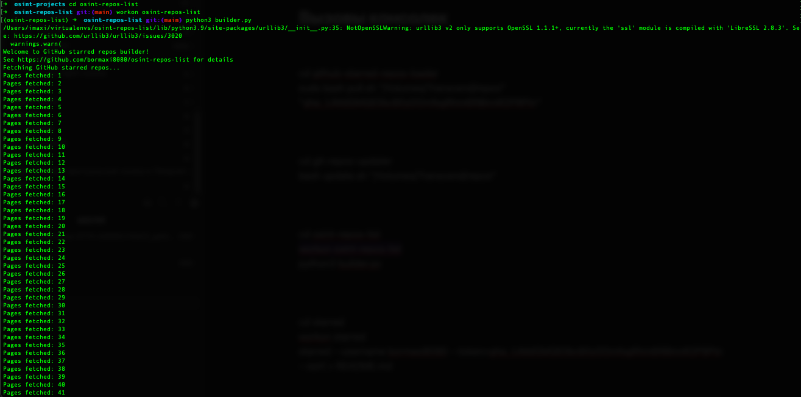
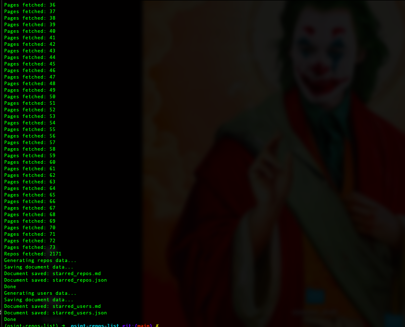
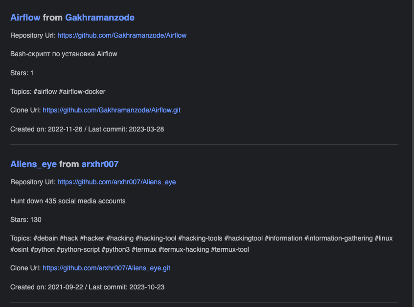
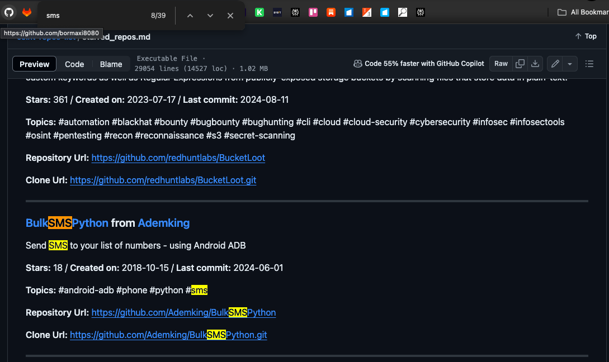
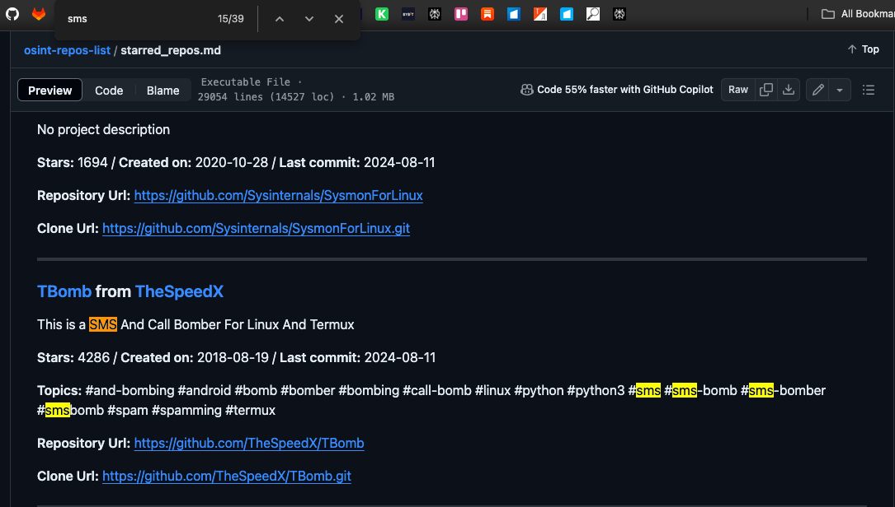

# OSINT Repos List

This repository encapsulates a list of repositories from the GitHub, marked with an asterisk relating to the subject of OSINT, Cybersecurity, DevOps / System Administration and specific development.

The list of starred repositories is here: https://github.com/bormaxi8080/osint-repos-list/blob/main/starred_repos.md

The list of starred repositories creators is here: https://github.com/bormaxi8080/osint-repos-list/blob/main/starred_users.md

## Build repos List

Python script for build all your starred GitHub repositories information in JSON and Markdown documents named as builder.py.

To build repos list run:

```python3 builder.py```

This Python script helps for generate Markdown description document contains all your GitHub starred repositories.

This is typically needed in a situation when you have many starred repositories to view, such as collection of various utilities.

This script does simple things:

> Gets list of your starred GitHub repositories.
>
> Generate JSON and Markdown documents with your GitHub starred repos statistics

That's all.

*It works on GitHub only! (not in GitLab or BitBucket)

### WARNING! 

All tools, programs and techniques published in this repository are used for informational, educational purposes or for information security purposes. The authors are not responsible for the activities that users of these tools and techniques may carry out, and urge them not to use them to carry out harmful or destructive activities directed against other users or groups on the Internet.

### Important!

If you have a lot of starred GitHub repositories, operations may take a long time to complete.

## Usage:

- Clone this repository
- Create environment variable GITHUB_API_TOKEN with your GitHub API token
- Run 'python3 builder.py' and wait





- Bingo!!!

Results:


### NOTE: Simplification of the output: image badges have been removed, since with a large number of repositories, a document is generated that is too large and the page freezes.



### SEARCH EXAMPLE:

You can search repos by keyword. For example, search repos by "SMS" keyword:






You can see full repos list in Markdown:

> [starred_repos.md](./starred_repos.md) 

> [starred_users.md](./starred_users.md)

and JSON:

> [starred_repos.json](./starred_repos.json) 

> [starred_users.json](./starred_users.json)

## Related projects:

I use [github-starred-repos-loader](https://github.com/bormaxi8080/github-starred-repos-loader) and [git-repos-updater](https://github.com/bormaxi8080/git-repos-updater) shell scripts to pull and update my starred GitHub collected repos locally.

## Notes:

### How to get your GitHub personal API access token for API:

[https://docs.github.com/en/authentication/keeping-your-account-and-data-secure/creating-a-personal-access-token](https://docs.github.com/en/authentication/keeping-your-account-and-data-secure/creating-a-personal-access-token)

### More about GitHub stars:

[https://stars.github.com/](https://stars.github.com/)

### More about GitHub API:

[https://docs.github.com/en/rest](https://docs.github.com/en/rest)

### More about GitHub Starred API:

[https://docs.github.com/en/rest/activity/starring](https://docs.github.com/en/rest/activity/starring)

### More About GitHub API Pagination Requests:

[https://docs.github.com/en/rest/guides/traversing-with-pagination](https://docs.github.com/en/rest/guides/traversing-with-pagination)
